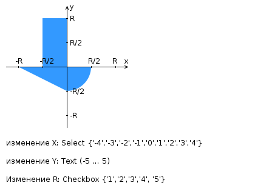

# Лабораторная работа №1
## Текст задания:

Разработать HTML-страницу с JS и CSS, определяющую попадание точки на координатной плоскости в заданную область. Область задается по варианту и приведена выше на рисунке. Требуется нарисовать ее средствами Canvas.

Кроме координатной плоскости, на странице должна быть HTML форма с полями X, Y, R. На рисунке по вашему варианту кроме самой координатной области определены типы полей формы и область допустимых значений для каждого поля. Страница должна содержать сценарий на языке JavaScript, осуществляющий валидацию значений, вводимых пользователем в поля формы. Любые некорректные значения (например, буквы в координатах точки или отрицательный радиус) должны блокироваться.

Точки должны определяться на основе данных формы, факт попадания точки должен вычисляться при помощи JS в момент отправки формы. Результаты проверок должны отображаться в таблице на странице, а также сохраняться при перезагрузке страницы. Для реализации сохранения точек между перезагрузками требуется использовать LocalStorage.

Помимо данных из формы в таблице результатов должно отображаться дата и время, когда была выполнена проверка. Дата и время должны отображться с учетом часового пояса клиентского устройства, т.е. при смене часового пояса на устройстве отображаемые даты и время должны корректным образом пересчитаться, чтобы отображать тот же самый момент времени. Требуется отображать дату и время строго в русской локализации.

Разработанная HTML-страница и все необходимые для нее CSS и JS файлы должны быть развёрнуты на сервере Helios под управлением штатного веб-сервера и быть публично доступны.

<b>Инструкция о том, как сделать страницу публично доступной размещена в курсе на LMS. Не требуется самостоятельно поднимать веб-сервер на Helios.

<b>Разработанная HTML-страница должна удовлетворять следующим требованиям (требования различаются между вариантами!):

- Для расположения текстовых и графических элементов необходимо использовать блочную верстку.
- Таблицы стилей должны располагаться в самом веб-документе.
- При работе с CSS должно быть продемонстрировано использование селекторов идентификаторов, селекторов дочерних элементов, селекторов псевдоэлементов, селекторов атрибутов, а также такие свойства стилей CSS, как наследование и каскадирование.
- HTML-страница должна иметь «шапку», содержащую ФИО студента, номер группы и номер варианта. При оформлении шапки необходимо явным образом задать шрифт (serif), его цвет и размер в каскадной таблице стилей.
- Отступы элементов ввода должны задаваться в пикселях.
